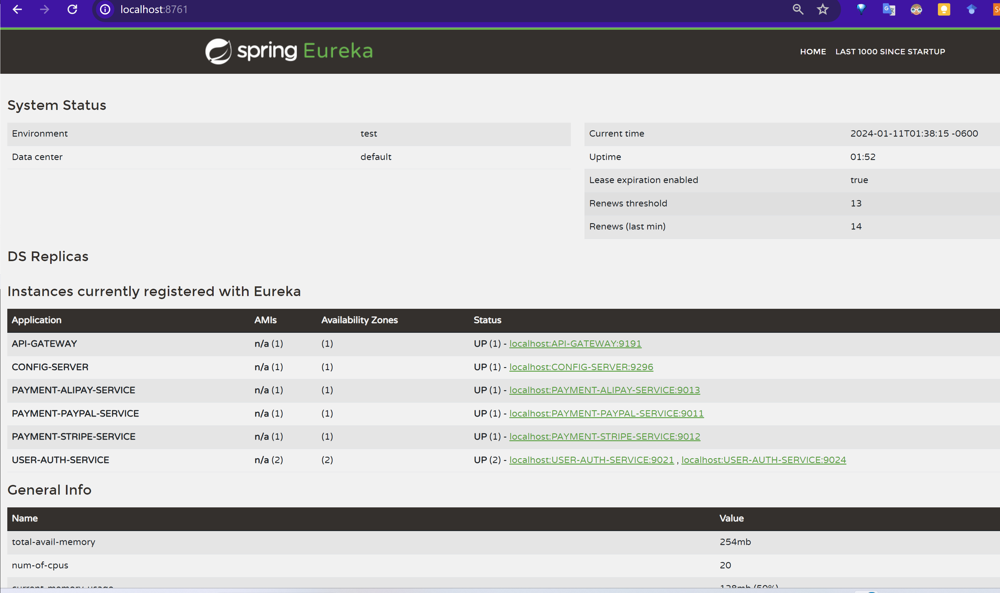

# Refer
[1] https://github.com/coco2023/QuickMall-eCommerce/tree/main/3%20EcommerceBackend

[2] ChatGPT: https://chat.openai.com/share/2cbbd05f-06c4-4933-a29a-1ccd7b2803e5

# Eureka

# Cloud Service Registry @EnableEurekaClient
These dependencies are used in Spring Boot applications, and their names in the Spring Initializr generally align with their artifact IDs. Here's a breakdown of each:

1. **spring-boot-starter-actuator**: In Spring Initializr, this is typically referred to as "Actuator". It provides production-ready features to help you monitor and manage your application.

2. **spring-boot-starter-webflux**: This is known as "Reactive Web" in Spring Initializr. It's used for building reactive web applications using Spring WebFlux.

3. **spring-cloud-starter**: In the Spring Initializr, this might not be directly listed as "Spring Cloud Starter". Spring Cloud dependencies often have to be manually added, or you choose specific starters based on the functionality, like "Config Client", "Eureka Discovery", etc.

4. **spring-cloud-starter-gateway**: This is referred to as "Gateway" in Spring Initializr. It's used for building API gateways.

5. **spring-cloud-starter-netflix-eureka-client**: Known as "Eureka Discovery Client" in Spring Initializr. It's used to register a service with Eureka server for service discovery.

6. **spring-boot-starter-test**: This is simply "Spring Boot Test Starter" in Spring Initializr. It's used for testing Spring Boot applications.

7. **reactor-test**: This might not have a direct equivalent in Spring Initializr, as it is a dependency for testing reactive applications. You might need to add it manually to your project.

8. **spring-cloud-starter-circuitbreaker-reactor-resilience4j**: This specific starter might not be directly available in Spring Initializr. Generally, you would add "Resilience4J" for circuit breaker patterns in Spring Cloud applications, but the exact name might vary or need manual addition to your project's build configuration.

In some cases, especially with Spring Cloud dependencies, you might need to add them manually to your project as they may not be available directly through the Spring Initializr interface.

# Cloud Gateway 
The dependencies you've listed are for specific features in Spring Boot applications. Here's a breakdown of each and their corresponding names in the Spring Initializr:

1. **spring-cloud-config-server**:
    - **Maven Artifact ID**: `spring-cloud-config-server`
    - **Spring Initializr Name**: This dependency is for setting up a Spring Cloud Config Server. It might not be directly listed as an option in the Spring Initializr. Generally, for Spring Cloud related dependencies, you might need to add them manually to your `pom.xml` or `build.gradle` files.

2. **spring-cloud-starter-netflix-eureka-client**:
    - **Maven Artifact ID**: `spring-cloud-starter-netflix-eureka-client`
    - **Spring Initializr Name**: "Eureka Discovery Client". This starter is used for integrating your application with Netflix Eureka for service discovery.

3. **spring-boot-starter-test**:
    - **Maven Artifact ID**: `spring-boot-starter-test`
    - **Spring Initializr Name**: "Spring Boot Test Starter". This is a common dependency for testing Spring Boot applications and includes libraries such as JUnit, Hamcrest, and Mockito.

In cases where a specific Spring Cloud starter is not directly available through the Spring Initializr, you often need to manually add them to your project configuration. This is common with more advanced or specific configurations like setting up a Config Server or using certain parts of the Netflix OSS suite.

# Cloud Service Registry @EnableEurekaServer
The dependencies you've listed are used in Spring Boot applications, particularly for Spring Cloud and testing functionalities. Here's how they are represented in the Spring Initializr:

1. **spring-cloud-starter**:
    - **Maven Artifact ID**: `spring-cloud-starter`
    - **Spring Initializr Name**: This is a general Spring Cloud starter and might not directly correspond to a specific entry in the Spring Initializr. It’s a part of the Spring Cloud umbrella and generally used to include common cloud-related dependencies. You might need to manually add this dependency to your project if you're looking for base cloud capabilities.

2. **spring-cloud-starter-netflix-eureka-server**:
    - **Maven Artifact ID**: `spring-cloud-starter-netflix-eureka-server`
    - **Spring Initializr Name**: "Eureka Server". This starter is used for creating a service registry server with Netflix Eureka, which allows microservices to register themselves and discover other services.

3. **spring-boot-starter-test**:
    - **Maven Artifact ID**: `spring-boot-starter-test`
    - **Spring Initializr Name**: "Spring Boot Test Starter". This starter is used for testing Spring Boot applications. It bundles common testing libraries like JUnit, Hamcrest, Mockito, and others.

It's important to note that while Spring Initializr provides a convenient way to generate project scaffolding with basic dependencies, it may not cover all specific starters, especially those related to specific cloud or microservices features. In such cases, you may need to manually add the dependencies to your project's `pom.xml` or `build.gradle` file.

